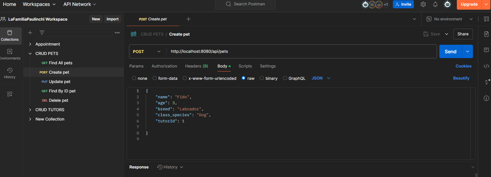
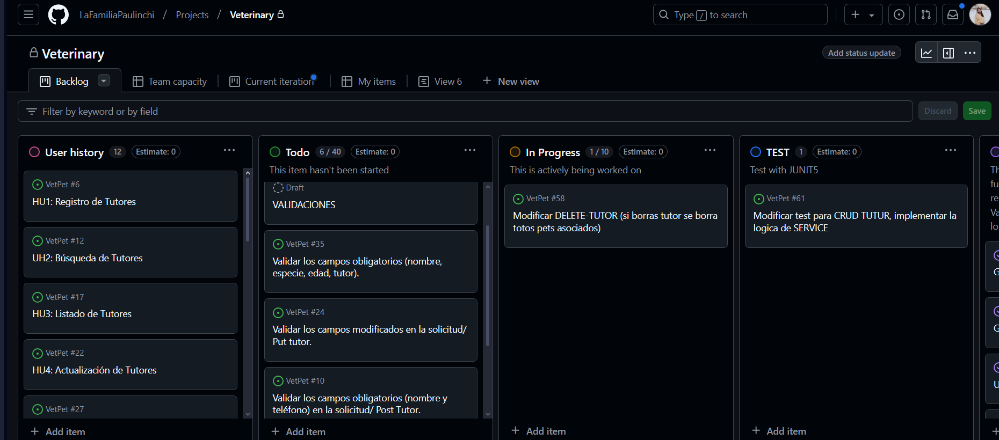

# 🐾 <span style="color: #32CD32;">**Proyecto Clínica Veterinaria API REST**

## 📖 Índice
1. [Descripción del Proyecto](#descripción-del-proyecto)
2. [Características Principales](#características-principales)
3. [Estructura del Proyecto](#estructura-del-proyecto)
4. [Instalación y Configuración](#instalación-y-configuración)
5. [Endpoints de la API](#endpoints-de-la-api)
6. [Gestor de Citas](#gestor-de-citas)
7. [Tecnologías Utilizadas](#tecnologías-utilizadas)
8. [Contribución](#contribución)


## 💡 <span style="color:blue;">**Descripción del Proyecto**
Este proyecto es una API REST desarrollada en Java Spring Boot para gestionar los datos de tutores, mascotas y citas en una clínica veterinaria. La API permite registrar, listar, actualizar y eliminar información relacionada con mascotas, tutores y citas.

## 🚀 <span style="color:blue;">**Características Principales**
- 🐾 **<span style="color:pink;">Gestión de Mascotas (Pets)**

    - Registrar una nueva mascota.
    - Listar todas las mascotas.
    - Buscar una mascota por su ID.
    - Actualizar los datos de una mascota.
    - Eliminar una mascota por su ID.
  
- 👩‍⚕️ **<span style="color:pink;">Gestión de Tutores**
    - Registrar un nuevo tutor.
    - Listar todos los tutores.
    - Buscar un tutor por su ID.
    - Actualizar los datos de un tutor.
    - Eliminar un tutor por su ID.

- ✍️ **<span style="color:pink;">Gestión de Citas**

    - Registrar nuevas citas.
    - Listar todas las citas o una específica.
    - Cancelar citas por ID.


###  <span style="color:blue;">📂 **Estructura del Proyecto**
- **PetController**: Gestiona las operaciones relacionadas con las mascotas.
- **TutorController**: Gestiona las operaciones relacionadas con los tutores.
- **AppointmentController**: Gestiona las operaciones relacionadas con las citas.
- **PetService**: Contiene la lógica de negocio para las mascotas.
- **TutorService**: Contiene la lógica de negocio para los tutores.
- **AppointmentService**: Contiene la lógica de negocio para las citas.
- **PetRepository**, **TutorRepository** y **AppointmentRepository**: Repositorios para acceder a la base de datos.
- **Exceptions**: Contiene las excepciones personalizadas.

## 📦 <span style="color:blue;">**Endpoints de la API**

| **Método** | **Endpoint**           | **Descripción**                              |
|------------|------------------------|----------------------------------------------|
| **GET**    | `/api/pets`            | Obtener todas las mascotas.                 |
| **GET**    | `/api/pets/{id}`       | Obtener una mascota específica.             |
| **POST**   | `/api/pets`            | Registrar una nueva mascota.                |
| **PUT**    | `/api/pets/{id}`       | Actualizar datos de una mascota.            |
| **DELETE** | `/api/pets/{id}`       | Eliminar una mascota específica.            |
| **GET**    | `/api/tutors`          | Obtener todos los tutores.                  |
| **GET**    | `/api/tutors/{id}`     | Obtener un tutor específico.                |
| **POST**   | `/api/tutors`          | Registrar un nuevo tutor.                   |
| **PUT**    | `/api/tutors/{id}`     | Actualizar datos de un tutor.               |
| **DELETE** | `/api/tutors/{id}`     | Eliminar un tutor específico.               |
| **POST**   | `/api/appointments`    | Registrar una nueva cita.                   |
| **GET**    | `/api/appointments`    | Listar todas las citas.                     |
| **GET**    | `/api/appointments/{id}` | Obtener una cita específica.                |
| **DELETE** | `/api/appointments/{id}` | Cancelar una cita.                          |
            |

### ✍️ <span style="color:magenta;">**Ejemplo de solicitud para registrar una mascota:**
        ```json
    POST /api/pets
             {
            "name": "Luna",
            "age": 3,
            "species": "Gato",
             "tutorId": 1
            }

💻 <span style="color:blue;">Gestor de Citas
1. 🔍 <span style="color:pink;">Registrar una cita
   Endpoint:
   POST /appointments

Request:

    json
    Copiar código
    {
    "date": "2024-04-15",
    "time": "15:30",
    "reason": "Vaccination",
    "petId": 1
    }
Response:

    json
    Copiar código
    {
    "id": 1,
    "date": "2024-04-15",
    "time": "15:30",
    "reason": "Vaccination",
    "pet": {
    "id": 1,
    "name": "Buddy",
    "species": "dog",
    "breed": "Labrador Retriever",
    "age": 4,
    "guardian": {
    "id": 1,
    "name": "Alice Johnson",
    "email": "alice.johnson@email.com",
    "phone": "987654321",
    "address": "123 Meadow Lane"
    }
    }
    }
2. 🎯 <span style="color:pink;">Obtener una cita por su ID
   Endpoint:
   GET /appointments/{id}

Response:

    json
    Copiar código
    {
    "id": 1,
    "date": "2024-04-15",
    "time": "15:30",
    "reason": "Vaccination",
    "pet": {
    "id": 1,
    "name": "Buddy",
    "species": "dog",
    "breed": "Labrador Retriever",
    "age": 4,
    "guardian": {
    "id": 1,
    "name": "Alice Johnson",
    "email": "alice.johnson@email.com",
    "phone": "987654321",
    "address": "123 Meadow Lane"
    }
    }
    }
3.🎫 <span style="color:pink;"> Listar todas las citas
   Endpoint:
   GET /appointments

Response:

    json
    Copiar código
    [
    {
    "id": 1,
    "date": "2024-04-15",
    "time": "15:30",
    "reason": "Vaccination",
    "pet": {
    "id": 1,
    "name": "Buddy",
    "species": "dog"
    }
    },
    {
    "id": 2,
    "date": "2024-04-18",
    "time": "10:00",
    "reason": "Checkup",
    "pet": {
    "id": 2,
    "name": "Max",
    "species": "cat"
    }
    }
    ]


## 🛠️ <span style="color:blue;">Tecnologías Utilizadas</span>
- <span style="color:green;">Java 17:</span> Lenguaje de programación principal.
- <span style="color:green;">Spring Boot:</span> Framework para el desarrollo de la API.
- <span style="color:green;">Maven:</span> Herramienta de construcción y gestión de dependencias.
- <span style="color:green;">Base de datos:</span> H2 .
- <span style="color:green;">Postman:</span> Para probar los endpoints.

---


### <span style="color:magenta;">Configurar la Base de Datos
Edita el archivo application.properties para establecer las credenciales de tu base de datos:
properties

        spring.application.name=VetPet
        spring.h2.console.enabled=true
        
        spring.datasource.url=jdbc:h2:mem:VetPet
        spring.datasource.driverClassName=org.h2.Driver
        spring.datasource.username= <tu_nombre_de_usuario>
        spring.datasource.password= <tu_contraseña> o se pude dejarlo vacio
        
        spring.jpa.show-sql=true
        spring.jpa.properties.hibernate.format_sql=true
La base de datos esta corriendo en: http://localhost:8080/h2-console/
###  🧪 <span style="color:magenta;">**Ejecutar Tests**

Para ejecutar los tests de este proyecto, sigue los pasos a continuación:

### **Requisitos previos**
Asegúrate de que tienes las dependencias necesarias instaladas (JUnit 5 y Spring Boot Starter Test).

### **Ejecutar Tests con Maven**
Si estás usando Maven, puedes ejecutar los tests con el siguiente comando:

    ```bash
         mvn test

📖 <span style="color:magenta;">Uso

Clonar el repositorio: bash

    git clone https://github.com/<tu-repositorio>.git
Configurar el Backend: Dirígete al directorio backend/. Configura el archivo application.properties según tus necesidades.

Ejecuta la aplicación Spring Boot:

    mvn spring-boot:run

## 📝 <span style="color:blue;">Organización del Equipo de trabajo

### **Uso de Postman para pruebas API**

En nuestro equipo utilizamos **Postman** para realizar pruebas de nuestra API, lo que nos permite probar cada endpoint y mantener la documentación centralizada. Para colaborar de manera eficiente, seguimos los siguientes pasos:

1. **<span style="color:green;">Colección de Postman**: Toda la colección de nuestras APIs se encuentra disponible en un archivo exportado de Postman. Este archivo incluye todos los endpoints y ejemplos de solicitudes y respuestas.

2. **<span style="color:green;">Pruebas de Endpoints**: Cada miembro del equipo puede importar esta colección en su propia instancia de Postman para ejecutar las pruebas en el servidor local o en el entorno de pruebas. Esto garantiza que todas las solicitudes se ejecuten de manera uniforme y se compartan los resultados de las pruebas de manera efectiva.

3. **<span style="color:green;">Variables de Entorno**: Usamos variables de entorno para manejar configuraciones como URLs de desarrollo, credenciales de API, y tokens de autenticación. Esto asegura que todos los miembros del equipo trabajen con las configuraciones correctas sin modificar el entorno global.

4. **<span style="color:green;">Documentación de Postman**: Toda la documentación relacionada con las API se mantiene dentro de Postman, donde cada solicitud tiene su propia descripción y ejemplo. De esta manera, todos pueden entender rápidamente cómo interactuar con la API.

#### **<span style="color:green;">Pasos para importar la colección de Postman:**
1. Descargar la colección desde el siguiente enlace: [Colección Postman API Veterinaria](https://lafamiliapaulinchi.postman.co/workspace/LaFamiliaPaulinchi-Workspace~2a0eac88-d382-4ae3-a42d-cc9642eebf64/overview).
2. Abrir Postman y hacer clic en "Importar".
3. Seleccionar el archivo descargado para cargar la colección.
4. Configurar las variables de entorno si es necesario.

   

## 🛠️ <span style="color:blue;">**Uso de GitHub para Gestión de Tareas y Revisión de Código**</span>

En **<span style="color:green;">GitHub**, organizamos nuestro código y gestionamos las tareas utilizando **Issues** y **Pull Requests**. El flujo de trabajo es el siguiente:

1. **<span style="color:green;">Branching**: Cada miembro del equipo trabaja en una rama separada, basada en `main` o `develop`. Las ramas se nombran según la tarea asignada, por ejemplo: `feature/registro-mascota`.

2. **<span style="color:green;">Issues**: Cada tarea se gestiona como un **Issue** en GitHub. Un **Issue** describe el trabajo que se debe realizar, y se asigna al miembro del equipo correspondiente.

3. **<span style="color:green;">Pull Requests**: Una vez que se completa una tarea en una rama, se crea un **Pull Request (PR)**. Los miembros del equipo revisan el PR, haciendo comentarios y sugiriendo cambios si es necesario. Una vez aprobado, el PR se fusiona con la rama `main`.

4. **<span style="color:green;">GitHub Projects (Tablero Kanban)**: Usamos la funcionalidad de **GitHub Projects** para tener un tablero **Kanban** que nos permite visualizar las tareas pendientes, en progreso y completadas. Las tareas se organizan por columnas como:
    - 📝 <span style="color: #2E8B57;">**To Do**</span>: Tareas por hacer.
    - 🔄 <span style="color: #FFD700;">**In Progress**</span>: Tareas en curso.
    - ✅ <span style="color: #32CD32;">**Done**</span>: Tareas completadas.

#### **<span style="color:magenta;">Acceder al Tablero de GitHub Projects:**
1. Abre el repositorio de **GitHub**.
2. Dirígete a la pestaña **Projects**.
3. Accede al proyecto correspondiente para ver el tablero Kanban con todas las tareas y su progreso.

Este sistema ayuda a tener un flujo de trabajo organizado y transparente, asegurando que todos los miembros del equipo estén al tanto de las tareas y el progreso del proyecto.




## <span style="color:blue;"> Diagrama UML

Este es el diagrama de la base de datos utilizada en el proyecto:


## <span style="color: #32CD32;">🤝 Contribuidores

Equipo de Desarrollo:

- <span style="color: #32CD32;">Juan Ignacio -https://github.com/juanignacioFG
- <span style="color: #32CD32;">Yuliia -https://github.com/YuliiaBi1a
- <span style="color: #32CD32;">Evelyn - https://github.com/evymari
- <span style="color: #32CD32;">Carito - https://github.com/carovasq
- <span style="color: #32CD32;">Paula - https://github.com/PCalvoGarcia

¡Gracias por visitar nuestro proyecto! 🎉
